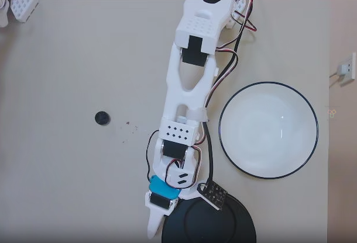

*****
Data
*****

💌 B站官方 `实战VLA，WAM机器人数据集 LeRobotDataset Pi0.5项目数据处理 <https://www.bilibili.com/video/BV1ycL66ZEn6>`_

💌 B站官方 `机器人模型(VLA, WAM)在学什么？DROID数据集1小时数据流 <https://www.bilibili.com/video/BV1VDEE6dE8m>`_

训练一个AI模型最重要的就是数据。为了更好的体验效果，需要自己录制数据集。录制的数据集默认需要上传的Hugging Face。所以需要注册Hugging Face账号。

Hugging Face平台的注册对于注册的网络IP地址有地理位置限制。最好是使用US(American)的地理位置。

注册完成后需要申请 Access Token，这东西只出现一次，记得保存好。通过这个token可以在命令行中访问自己的HF账号的数据。

.. code-block:: shell

    # eg. hf auth login --token hf_dfhidhdihsidhfdDjk --add-to-git-credential
    hf auth login --token ${HUGGINGFACE_TOKEN} --add-to-git-credential

HF＿USER
========

windows与linux的 ``$HF_USER`` 的命令有区分。

win-PowerShell
--------------

.. code-block:: console

    $output = hf auth whoami
    $HF_USER = ($output -split ' ')[2]
    echo $HF_USER

linux
-----

.. code-block:: console

    HF_USER=$(NO_COLOR=1 hf auth whoami | awk -F': *' 'NR==1 {print $2}')
    echo $HF_USER

.. note::

    ``$HF_USER`` 本质就是我们 Hugging Face 的用户名， 命令行中的 ``${HF_USER}`` 可以直接用自己的名字替换，没有任何区别。

    或者我们可以直接明确规定我们的名字。毕竟是大家自己注册的。

    .. code-block:: console

        HF_USER=JiaMinEsc
        echo $HF_USER

Working Dir
===========
执行下面的所有脚本，保证自己在lerobot的项目路径里。而不是随便一个地方。

.. code-block:: console

    cd lerobot
    # (lerobot) escommune@escommune-ZOIKEZ9T09Y56:~/Public/GItHub/lerobot$

Collect Data
============

数据存储
-------

- 数据以 ``LeRobotDataset`` 格式存储，并在录制期间保存到磁盘。`实战VLA，WAM机器人数据集 LeRobotDataset Pi0.5项目数据处理 <https://www.bilibili.com/video/BV1ycL66ZEn6>`_
- 默认情况下，录制完成后数据集会自动推送到你的 Hugging Face 页面。
- 如需禁用上传功能，请使用 ``--dataset.push_to_hub=False``。

.. note::

    **推荐：** 禁用上传功能后，手动将本地数据集推送到 Hub，运行以下命令：

    .. code-block:: bash

        repo_id=JiaMinEsc/stack-3-cube
        hf upload ${repo_id} ~/.cache/huggingface/lerobot/${repo_id} --repo-type dataset

录制参数
-------

使用命令行参数设置数据记录的流程：

- ``--dataset.episode_time_s=60`` 每次数据记录episode的持续时间（默认：**60秒**）。
- ``--dataset.reset_time_s=60`` 每轮结束后重置环境的持续时间（默认：**60秒**）。
- ``--dataset.num_episodes=50`` 总共要记录的episode数量（默认：**50**）。

录制期间的键盘控制
----------------

使用键盘快捷键控制数据记录流程：

- 按下 **右箭头键（ ``→`` ）**：提前停止当前episode，或跨过 ``reset_time_s`` 时间并进入下一个episode的录制。**这个非常重要，任务完成后截停。** 参阅DROID最佳实践， `机器人模型(VLA, WAM)在学什么？DROID数据集1小时数据流 <https://www.bilibili.com/video/BV1VDEE6dE8m>`_
- 按下 **左箭头键（ ``←`` ）**：取消当前episode并重新录制。
- 按下 **Esc 键（ ``ESC`` ）**：立即停止录制，编码视频并上传数据集。

检查点与恢复
----------

- 录制过程中会自动创建检查点。
- 如果出现异常 (比如你本来要录50条，结果录到25条想去来一局，按ESC后停止录制), 或者你想在一个已经录制好50条数据的数据集里再加50条，可以通过使用 ``--resume=true`` 重新运行相同命令来恢复。恢复录制时，必须将 ``--dataset.num_episodes`` 设置为 **需要额外录制的episode数量** ，而不是数据集中目标总episode数！
- 5.0后，数据集的 ``repo-id`` 默认会追加录制时间。

环境设置
-------

.. admonition:: Prescript
    :collapsible: closed

    .. code-block:: bash

        conda activate lerobot
        lerobot-find-port
        sudo chmod 777 /dev/ttyACM0 && sudo chmod 777 /dev/ttyACM1
        cd lerobot
        lerobot-find-cameras opencv
        HF_USER=JiaMinEsc # 换成自己的用户名
        echo $HF_USER

一开始环境可能乱遭遭的，我们可以打开录制功能，借此进行环境的设置，练习一下任务的遥操作，并且不想默认被上传到HF。所以我们的录制的核心参数如下：

- ``--episode=1``
- ``--episode_time_s=300`` 5分钟
- ``--single_task=“env setup”``
- ``--dataset.push_to_hub=False`` 不要上传

.. code-block:: bash

    lerobot-record \
        --robot.type=so101_follower \
        --robot.port=/dev/ttyACM1 \
        --robot.id=my_19kg_follower_arm \
        --robot.cameras="{ hand: {type: opencv, index_or_path: 0, width: 640, height: 480, fps: 30, fourcc: 'MJPG'}, env: {type: opencv, index_or_path: 4, width: 640, height: 480, fps: 30, fourcc: 'MJPG'}}" \
        --teleop.type=so101_leader \
        --teleop.port=/dev/ttyACM0 \
        --teleop.id=my_awesome_leader_arm \
        --display_data=true \
        --dataset.repo_id=${HF_USER}/env-setup \
        --dataset.num_episodes=1 \
        --dataset.episode_time_s=300 \
        --dataset.single_task="env setup" \
        --dataset.streaming_encoding=true \
        --dataset.encoder_threads=2 \
        --dataset.push_to_hub=False

实际录制
-------
录制一个抓葡萄到碗里的数据集。大家可以去买点葡萄，广东的蓝莓葡萄10元/斤。50个episode。不推送到HUB上。

.. code-block:: bash

    lerobot-record \
        --robot.type=so101_follower \
        --robot.port=/dev/ttyACM1 \
        --robot.id=my_19kg_follower_arm \
        --robot.cameras="{ hand: {type: opencv, index_or_path: 0, width: 640, height: 480, fps: 30, fourcc: 'MJPG'}, env: {type: opencv, index_or_path: 4, width: 640, height: 480, fps: 30, fourcc: 'MJPG'}}" \
        --teleop.type=so101_leader \
        --teleop.port=/dev/ttyACM0 \
        --teleop.id=my_awesome_leader_arm \
        --display_data=true \
        --dataset.repo_id=${HF_USER}/pick-grapes-put-bowl \
        --dataset.num_episodes=1 \
        --dataset.episode_time_s=300 \
        --dataset.single_task="Pick up the grapes and put them in the bowl" \
        --dataset.streaming_encoding=true \
        --dataset.encoder_threads=2 \
        --dataset.push_to_hub=False

手动上传
-------
2026年4月28日。lerobot更新了默认加时间戳，但是有点不太好。我们到cache里，删除时间戳，之后上传。

.. code-block:: bash

    repo_id=${HF_USER}/pick-grapes-put-bowl
    echo ${repo_id}

.. code-block:: bash

    hf upload ${repo_id} ~/.cache/huggingface/lerobot/${repo_id} --repo-type dataset

Ref
===

.. [1] LeRobot DoC "Imitation Learning on Real-World Robots" https://huggingface.co/docs/lerobot/il_robots

