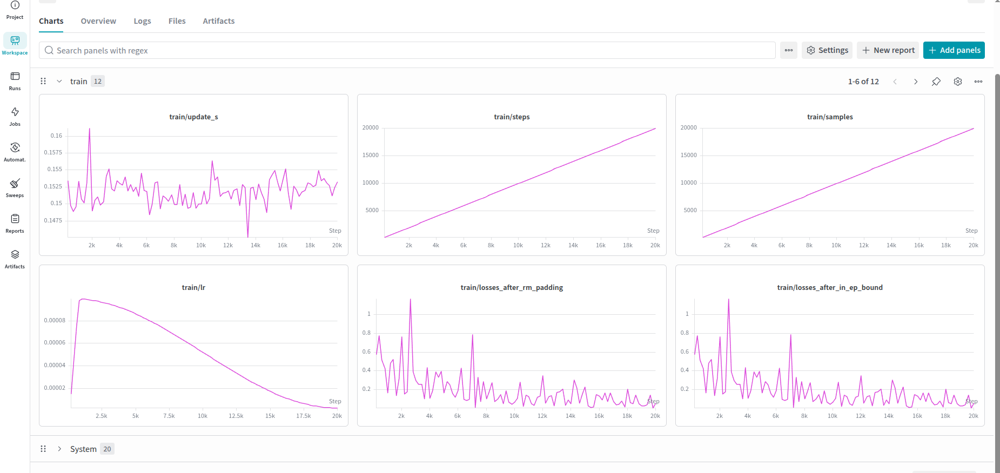
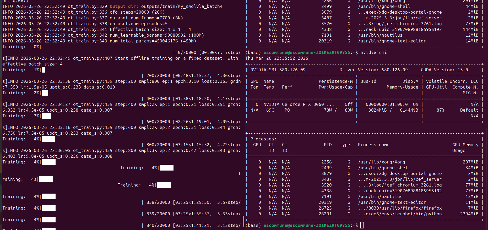

*******
Train
*******

Wandb [2]_
==========
训练过程图形化显示，没什么大用前期，毕竟刚入门连模型内部张什么样子都不清楚。使用之前需要登陆。登陆需要类似 ``HUGGINGFACE_TOKEN`` 的token。

.. code-block:: bash

    wandb login

本地训练 ``SmolVLA`` 的结果。

Train
=====

.. admonition:: Prescript
    :collapsible: closed

    .. code-block:: bash

        conda activate lerobot
        lerobot-find-port
        sudo chmod 777 /dev/ttyACM0 && sudo chmod 777 /dev/ttyACM1
        cd lerobot
        lerobot-find-cameras opencv
        wandb login
        HF_USER=JiaMinEsc # 换成自己的用户名
        echo $HF_USER

第一次玩，直接使用 ``ACT`` 就好。没必要好高骛远。ACT是从零开始训练一个模仿学习模型，虽然没有VLA名气大。但是 ``PI，SmolVLA`` 很多的设计思路来自ACT。

.. code-block:: bash

    lerobot-train \
      --dataset.repo_id=${HF_USER}/stack-3-cube \
      --policy.type=act \
      --output_dir=outputs/train/act_your_dataset \
      --job_name=act_stack-3-cube \
      --policy.device=cuda \
      --wandb.enable=false \
      --policy.repo_id=${HF_USER}/act_stack-3-cube

.. figure:: ../image/act_model_checkpoint.png
    :align: center

如果你的名字是 ``alex-hf`` 。可以直接使用下面的命令。

.. code-block:: bash

    lerobot-train \
      --dataset.repo_id=alex-hf/stack-3-cube \
      --policy.type=act \
      --output_dir=outputs/train/act_your_dataset \
      --job_name=act_stack-3-cube \
      --policy.device=cuda \
      --wandb.enable=false \
      --policy.repo_id=alex-hf/act_stack-3-cube

Infer and record
================

.. admonition:: Prescript
    :collapsible: closed

    .. code-block:: bash

        conda activate lerobot
        lerobot-find-port
        sudo chmod 777 /dev/ttyACM0 && sudo chmod 777 /dev/ttyACM1
        cd lerobot
        lerobot-find-cameras opencv

.. code-block:: bash

    lerobot-record \
      --robot.type=so101_follower \
      --robot.port=/dev/ttyACM1 \
      --robot.id=my_19kg_follower_arm \
      --robot.cameras="{ hand: {type: opencv, index_or_path: 0, width: 640, height: 480, fps: 30, fourcc: 'MJPG'}, env: {type: opencv, index_or_path: 4, width: 640, height: 480, fps: 30, fourcc: 'MJPG'}}" \
      --display_data=true \
      --dataset.repo_id=${HF_USER}/eval_act_stack_3_cube \
      --dataset.num_episodes=4 \
      --dataset.single_task="stack three cube, 1. spread them out so that they can be grabbed separately. 2. select a cube and place it in front of it as a base. 3. stack the other two onto the base." \
      --dataset.streaming_encoding=true \
      --dataset.encoder_threads=2 \
      --policy.path=outputs/train/act_your_dataset/checkpoints/last/pretrained_model

SmolVLA
=======

SmolVLA源自Pi0，但是作了裁减使得模型比较小。经过实测可以在一张 3060 6G 的笔记本上训练 batch_size=4, 显存占用3G。

SmolVLA Train
-------------

.. admonition:: Prescript
    :collapsible: closed

    .. code-block:: bash

        conda activate lerobot
        lerobot-find-port
        sudo chmod 777 /dev/ttyACM0 && sudo chmod 777 /dev/ttyACM1
        cd lerobot
        lerobot-find-cameras opencv

.. code-block:: bash

    lerobot-train \
      --policy.path=lerobot/smolvla_base \
      --dataset.repo_id=JiaMinEsc/stack-3-cube \
      --batch_size=4 \
      --steps=10000 \
      --output_dir=outputs/train/my_smolvla_batch4 \
      --job_name=my_smolvla_training \
      --policy.device=cuda \
      --wandb.enable=true \
      --policy.push_to_hub=false
      --rename_map='{"observation.images.env": "observation.images.camera1", "observation.images.hand": "observation.images.camera2"}'

``lerobot 5.0`` 新增加输入重命名。

.. code-block:: bash

    - Missing features: ['observation.images.camera1', 'observation.images.camera2', 'observation.images.camera3']
    - Extra features: ['observation.images.env', 'observation.images.hand']

SmolVLA Infer&Record [3]_
-------------------------

.. admonition:: Prescript
    :collapsible: closed

    .. code-block:: bash

        conda activate lerobot
        lerobot-find-port
        sudo chmod 777 /dev/ttyACM0 && sudo chmod 777 /dev/ttyACM1
        cd lerobot
        lerobot-find-cameras opencv

.. code-block:: bash

    lerobot-record \
      --robot.type=so101_follower \
      --robot.port=/dev/ttyACM1 \
      --robot.id=my_19kg_follower_arm \
      --robot.cameras="{ hand: {type: opencv, index_or_path: 0, width: 640, height: 480, fps: 30, fourcc: 'MJPG'}, env: {type: opencv, index_or_path: 4, width: 640, height: 480, fps: 30, fourcc: 'MJPG'}}" \
      --display_data=true \
      --dataset.repo_id=JiaMinEsc/eval_smolvla_stack_3_cube \
      --dataset.num_episodes=4 \
      --dataset.single_task="stack three cube, 1. spread them out so that they can be grabbed separately. 2. select a cube and place it in front of it as a base. 3. stack the other two onto the base." \
      --dataset.streaming_encoding=true \
      --dataset.encoder_threads=2 \
      --policy.path=outputs/train/my_smolvla_batch4/checkpoints/last/pretrained_model \
      --dataset.rename_map='{"observation.images.env": "observation.images.camera1", "observation.images.hand": "observation.images.camera2"}'

Ref
===

.. [1] LeRobot DoC "Imitation Learning on Real-World Robots" https://huggingface.co/docs/lerobot/il_robots
.. [2] Wandb QuickStart https://wandb.ai/quickstart?utm_source=app-resource-center&utm_medium=app&utm_term=quickstart
.. [3] Clllauk Github Lerobot issue #3181 2026.3.18 https://github.com/huggingface/lerobot/issues/3181