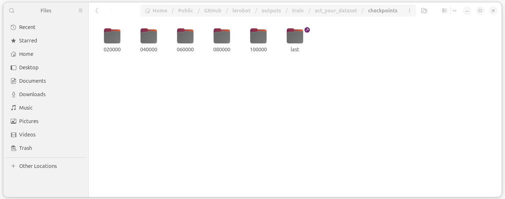

*******
Train
*******

训练一个AI模型最重要的就是数据。为了更好的体验效果，需要自己录制数据集。录制的数据集默认需要上传的Hugging Face。所以需要注册Hugging Face账号。

Hugging Face平台的注册对于注册的网络IP地址有地理位置限制。最好是使用US(American)的地理位置。

注册完成后需要申请 Access Token，这东西只出现一次，记得保存好。通过这个token可以在命令行中访问自己的HF账号的数据。

.. code-block:: console

    # eg. huggingface-cli login --token hf_dfhidhdihsidhfdDjk --add-to-git-credential
    huggingface-cli login --token ${HUGGINGFACE_TOKEN} --add-to-git-credential

HF＿USER
========

windows与linux的 ``$HF_USER`` 的命令有区分。

win-PowerShell
--------------

.. code-block:: console

    $output = hf auth whoami
    $HF_USER = ($output -split ' ')[2]
    echo $HF_USER

linux
-----

.. code-block:: console

    HF_USER=$(hf auth whoami | head -n 1)
    echo $HF_USER

.. note::

    ``$HF_USER`` 本质就是我们 Hugging Face 的用户名， 命令行中的 ``${HF_USER}`` 可以直接用自己的名字替换。没有任何区别。

Working Dir
===========
执行下面的所有脚本，保证自己在lerobot的项目路径里。而不是随便一个地方。

Collect Data
============
.. code-block:: console

    lerobot-record \
        --robot.type=so101_follower \
        --robot.port=/dev/ttyACM1 \
        --robot.id=my_19kg_follower_arm \
        --robot.cameras="{ hand: {type: opencv, index_or_path: 0, width: 640, height: 480, fps: 30, fourcc: 'MJPG'}, env: {type: opencv, index_or_path: 4, width: 640, height: 480, fps: 30, fourcc: 'MJPG'}}" \
        --teleop.type=so101_leader \
        --teleop.port=/dev/ttyACM0 \
        --teleop.id=my_awesome_leader_arm \
        --display_data=true \
        --dataset.repo_id=${HF_USER}/stack-3-cube \
        --dataset.num_episodes=50 \
        --dataset.episode_time_s=90 \
        --dataset.single_task="stack three cube, 1. spread them out so that they can be grabbed separately. 2. select a cube and place it in front of it as a base. 3. stack the other two onto the base." \
        --dataset.streaming_encoding=true \
        # --dataset.vcodec=auto \
        --dataset.encoder_threads=2

Train
=====
第一次玩，直接使用 ``ACT`` 就好。没必要好高骛远。ACT是从零开始训练一个模仿学习模型，虽然没有VLA名气大。但是 ``PI，SmolVLA`` 很多的设计思路来自ACT。

.. code-block:: bash

    lerobot-train \
      --dataset.repo_id=${HF_USER}/stack-3-cube \
      --policy.type=act \
      --output_dir=outputs/train/act_your_dataset \
      --job_name=act_stack-3-cube \
      --policy.device=cuda \
      --wandb.enable=false \
      --policy.repo_id=${HF_USER}/act_stack-3-cube

如果你的名字是 ``alex-hf`` 。可以直接使用下面的命令。

.. code-block:: bash

    lerobot-train \
      --dataset.repo_id=alex-hf/stack-3-cube \
      --policy.type=act \
      --output_dir=outputs/train/act_your_dataset \
      --job_name=act_stack-3-cube \
      --policy.device=cuda \
      --wandb.enable=false \
      --policy.repo_id=alex-hf/act_stack-3-cube

Infer and record
================

.. code-block:: bash

    lerobot-record \
      --robot.type=so101_follower \
      --robot.port=/dev/ttyACM1 \
      --robot.id=my_19kg_follower_arm \
      --robot.cameras="{ hand: {type: opencv, index_or_path: 0, width: 640, height: 480, fps: 30, fourcc: 'MJPG'}, env: {type: opencv, index_or_path: 4, width: 640, height: 480, fps: 30, fourcc: 'MJPG'}}" \
      --display_data=true \
      --dataset.repo_id=${HF_USER}/eval_act_stack_3_cube \
      --dataset.num_episodes=4 \
      --dataset.single_task="stack three cube, 1. spread them out so that they can be grabbed separately. 2. select a cube and place it in front of it as a base. 3. stack the other two onto the base." \
      --dataset.streaming_encoding=true \
      --dataset.encoder_threads=2 \
      --policy.path=outputs/train/act_your_dataset/checkpoints/last/pretrained_model

Ref
===

.. [1] LeRobot DoC "Imitation Learning on Real-World Robots" https://huggingface.co/docs/lerobot/il_robots
