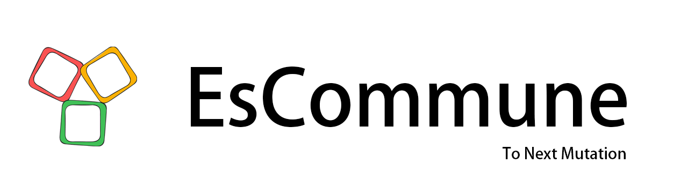

*************************************
Welcome to EsCommune's documentation!
*************************************

**To Next Mutation.**

Robot是人类进化的下一个阶段。

.. Important::

    当下所有机器人技术离真正的智能相去甚远。未来的某一天，地球会迎来下一代的生命，Robot。我们需要更多的天才头脑加入到这一场突变中，创造真正的 "Robot" 。That's why we were founded.

**电子羊公社(EsCommune)** 是一个关注AI与机器人的具身智能社区。定期分享前沿的研究，商业资讯。进行知识普及与发布技术教程。降低参与机器智能进化的门槛，创造真正的 "Robot" 。**To next Mutation.**

💌 B站官方 `电子羊公社 <https://space.bilibili.com/309967369>`_

🗺 开源文档 `电子羊公社 EscCommune <https://escommune.readthedocs.io>`_

🍄 QQ社区群 721718984

|:heart:|
|:rocket:|

Contents
========

.. toctree::

    embodied/index
    LeRobot/index
    contribute/index

.. note::

   This project is under active development.
   
https://www.sphinx-doc.org/zh-cn/master/usage/restructuredtext/index.html